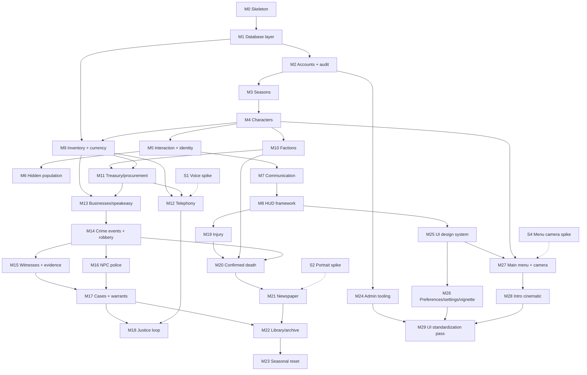

# Omertà RP — Development Roadmap (Phase 2)

Milestones are sized to be independently implementable and testable, each gated by its own design review (the project's Phase 3/4 process). Ordering follows Tech §24's five phases, expanded with the foundation the Tech doc assumes (M0–M1), the justice loop (M18, from P-002), the presentation track (M25–M29, from D-035), and explicit spikes for the high-risk areas in Tech §25.

**Definition of done for every milestone:** design review approved → implementation → self-review against the design → testing per the milestone's "testable when" → written handoff (what was built, why, extension points, integration points, test strategy). Placeholder art is always acceptable (D-005).

---

## Track A — Foundation (strictly ordered; everything depends on this)

### M0 — Gamemode skeleton and core framework
Bootable from-scratch gamemode: folder structure, module loader with dependency-ordered lifecycle, schema-validated configuration (shared vs. server-secret), logging with channels and an audit sink stub, net-message registry conventions with validation/rate-limit scaffolding, headless-testable pure-Lua core.
**Depends on:** nothing. **Testable when:** the gamemode boots on an empty map with zero errors; a demo module loads/enables in dependency order; malformed config fails loudly; core libraries pass unit tests under plain Lua.
**Design review:** `docs/design-reviews/M0_foundation.md` (delivered, awaiting approval).

### M1 — Database abstraction layer
Single async public API over SQLite (bundled) and MySQL/MariaDB via mysqloo, selected by one server-secret config value with zero gameplay-code changes (project-lead hard requirement). Parameterized queries only; migration runner with versioned migrations; transaction helpers; connection health/reconnect handling; query audit hooks.
**Depends on:** M0. **Testable when:** an identical test suite (CRUD, transactions, migration up/down, injection attempts, reconnect) passes against both backends unchanged.

### M2 — Accounts and audit foundation
Account records keyed by SteamID64 (Tech §2); connect/disconnect flow; moderation flags; career-stat skeleton; the real audit log (Tech §23) writing through M1.
**Depends on:** M1. **Testable when:** joining creates/loads an account on both backends; audited actions produce queryable rows.

### M3 — Seasons
Season lifecycle (create/activate/end states, ruleset version — Tech §2); everything season-scoped keys on SeasonID from birth. Includes the Q-2/Q-4 rulings (allegiance track selection, season-end character retirement) once decided.
**Depends on:** M2. **Testable when:** a season can be created and activated; account path selection is recorded; season state survives restart.

### M4 — Characters
Creation flow (first/last name, appearance descriptors captured for later portrait use — P-001), name validation and season-unique index (Tech §3), one-active-character rule (Q-3), spawn/load, retirement/death status fields.
**Depends on:** M3. **Testable when:** two accounts cannot create duplicate normalized names in a season; a character persists across reconnect and restart; appearance snapshot is stored.

### M5 — Interaction framework, identity, and introductions
Context-interaction system (target at range → server-validated actions); the Introduce Yourself flow writing IdentityKnowledge (Tech §5); `ResolveDisplayName` (Tech §6) with server-side resolution and minimal replication.
**Depends on:** M4. **Testable when:** with three clients, A↔B introduction updates only A and B; C still sees "Unknown"; knowledge persists across sessions; no full identity map ever reaches a client (verified by inspecting network traffic).

### M6 — Hidden-population hardening
Scoreboard suppression/replacement, join/leave and death-notice removal, team-API hygiene, chat/console leak audit (Tech §4); metagaming rules spec (deliverable). Spike S3's audit harness runs from here on.
**Depends on:** M5 (needs the custom identity layer to exist). **Testable when:** the S3 harness reports zero character-identity leaks in networked state; default HUD/scoreboard surfaces are gone.

### M7 — Communication core
Distance-based voice; range-limited local text treated as speech, per-recipient name resolution, server moderation log (Tech §7 local sections).
**Depends on:** M5. **Testable when:** text/voice reach only in-range clients; speaker labels resolve per-observer; moderation copies are queryable.

### M8 — Contextual HUD framework
UI-state controller: empty screen by default; stamina and injury indicators (placeholder logic), interaction prompts, accessibility baseline (scalable text, sound-independent cues) (Tech §8). Includes the Q-7 stamina ruling.
**Depends on:** M5, M7. **Testable when:** no permanent HUD elements render; each contextual element appears only under its condition.

### M9 — Inventory, items, and physical currency
Data-driven item definitions; capacity model; containers, equipment slots, concealment categories; server-authoritative transactional operations (Tech §9); denominated coin/bill items per D-004 (quarters exist here — M12 needs them).
**Depends on:** M1, M4. **Testable when:** all operations validate distance/permission/capacity; a dropped item survives restart; currency stacks merge/split correctly; duplication attempts via rapid parallel operations fail.

## Track B — Organizations

### M10 — Factions core: families and police department
The four family institutions and the PD as persistent season entities; rosters, rank ladders (GDD §4), configurable rank permissions; recruitment/promotion flows with sponsorship and approval (GDD §4.1); acting leadership and succession rules (Tech §19); family ledger; leadership rules spec (deliverable). Includes the Q-1 bootstrap ruling.
**Depends on:** M4; M9 for ledger/equipment tagging. **Testable when:** a full recruit→associate→soldier promotion chain works with correct permission gates; the Don going offline hands acting authority down the configured chain; all transitions are audited.

### M11 — Treasury and procurement
Family/PD treasuries with transactional, audited entries (Tech §10); data-driven procurement catalog (communications, weapons, medical, disguises, …); rank-gated purchasing; organization-owned equipment tagging.
**Depends on:** M10, M9. **Testable when:** concurrent spends cannot overdraw; every balance change has an audit row with approver; purchased items carry the organization tag.

### M12 — Telephony (payphones and private lines)
Per D-003: payphone world entities with server-validated quarter feed (connect cost + interval cost, low-change warning, drop on nonpayment); private lines purchasable through procurement, bound to owned locations; call mediation (server call state, participant-only remote audio, local-side spatial speech); text-call fallback for accessibility; number knowledge as learned data/notes; call-detail records for later warrants (Tech §7).
**Depends on:** M9 (quarters), M11 (private-line purchase), M7, **S1 outcome**. **Testable when:** a call connects only while quarters last; bystanders hear the local side only; a mic-less client completes a call via text; CDRs record line-to-line metadata, never content.

## Track C — City gameplay

### M13 — Businesses and the speakeasy
Business framework (Tech §11): ownership, manager rosters, inventory, ledgers, services; the speakeasy MVP (food/drink with Q-7 buffs, social space, storage, rumor NPC, surveillance points, newspaper spawn); offline-asset-protection ruling (Q-12) as part of this review.
**Depends on:** M9, M10/M11 for ownership and money flows. **Testable when:** a speakeasy sells stock from its inventory into its ledger; the rumor NPC serves rumor entries; access control follows ownership.

### M14 — Crime events, store robbery, NPC victims
Robbery operation state machine (Tech §16) built on **M20's EventService** (review improvement #1 — the dependency inverted once M20 turned out to need durable EventIDs first); NPC victim reaction model (weapon/mask/aggression/personality → comply/stall/alarm/flee — GDD §12); store robbery end-to-end with proceeds as physical cash.
**Depends on:** M9, M13; weapons decision Q-10. **Testable when:** a two-player masked store robbery produces an event, an alarm path, physical proceeds, and correct state transitions through Escaped/Failed.
**Note (C4):** bank robbery is a fast-follow content milestone on this framework — after M16/M17 prove the loop — rather than Phase 5 (pending approval of review improvement #3).

### M15 — Witnesses and evidence
Witness records with descriptor generation from actual appearance, confidence, decay (Tech §12); evidence entities with type, integrity, chain of custody (Tech §13); collection interactions for police; concealment interplay (masks vs. descriptors, gloves vs. fingerprints).
**Depends on:** M14. **Testable when:** a masked robbery yields descriptor-only witness records (never a CharacterID the witness couldn't know); collected evidence carries custody chains; decay measurably reduces recall.

### M16 — NPC police response
Alarm → delay → dispatch → secure → confront → scene-creation state machine with population-scaling inputs (Tech §15); defeatable, predictable, never identity-omniscient.
**Depends on:** M14. **Testable when:** with zero player police, an alarmed robbery produces an NPC response and a preserved evidence scene; response scales with configured heat inputs.

### M17 — Cases and warrants
Case files (suspects, evidence links, per-allegation strength — Tech §14); deterministic NPC-judge warrant thresholds; scope/expiration; illegal-search detection feeding department standing.
**Depends on:** M15; M16 for scene handoff. **Testable when:** linking sufficient evidence crosses the warrant threshold deterministically; out-of-scope searches are flagged and the evidence marked; the full store-robbery→case→warrant→arrest loop closes.

### M18 — Justice loop
Post-arrest consequence system per the P-002 selection (`04_justice_system_proposals.md`): booking, charges, plea/deal resolution, fines, probation, criminal records, appeals — whatever the chosen design specifies. Scope finalizes at its design review.
**Depends on:** M17; M11 (fines/bail money flows); M12 (the booking phone call). **Testable when:** per the selected proposal's flow — at minimum, an arrest resolves into recorded consequences without a raw jail timer, and an innocent release leaves the correct record trail.

## Track D — Consequences and history

### M19 — Injury, incapacitation, and medical care
The 7-state machine (Tech §17); incapacitation interactions (carry, search, arrest, treat); stabilization items, hospital, illegal doctor; recovery timers.
**Depends on:** M8 (indicators), M5 (interactions), and in practice M9 (searching, stabilization items) and M13 (the clinic). Can start in parallel with Track C after M8. **Testable when:** lethal-damage scenarios land in Incapacitated, not respawn; each listed interaction works on an incapacitated character; treatment paths lead to Recovering.
**Design review:** `docs/design-reviews/M19_injury.md` (APPROVED, IMPLEMENTED — §4a (a), §4b (b), §4c (a); logged as D-037).

### M20 — Confirmed death and succession
Deliberate, logged, interruptible confirm-kill interaction (Tech §18); death cascade (status, rank removal, succession trigger, death event, body/evidence preservation, newspaper eligibility, archive references, new-character flow); no automatic transfer of anything (GDD §19.3); confirmed-death rules spec (deliverable).
**Depends on:** M19, M10 (succession). **Testable when:** a confirmed kill on a Capo triggers the full cascade including acting-leadership handoff; the victim's player reaches new-character creation; every step is audited.
**Design review:** `docs/design-reviews/M20_death.md` (APPROVED, IMPLEMENTED — §4a/§4b/§4c all (a); logged as D-038).
**Dependency inverted:** this milestone previously depended on M14 for events. M20 is the first milestone that actually needs a durable EventID, so **M20 builds the EventService** (review improvement #1) and M14 consumes it. See that review's §2.

### M21 — Newspaper
Template-driven article generation from eligible events (Tech §20); scheduled issues (Q-6 cadence), frozen on publish; physical paper props/reading UI; Option E composite portraits from archived appearance data with silhouette fallback (P-001).
**Depends on:** M14/M20 (events), M4 (appearance snapshots); **S2 outcome**. **Testable when:** an identified public death produces a correct next-issue article with portrait; hidden information (factions, unwitnessed killers) never appears; issues are immutable after publication.

### M22 — Library and archive
Archive indexes (Tech §21); library browsing/search UI over seasons, characters, headlines, cases; public/private record rules.
**Depends on:** M21, M17. **Testable when:** every published issue and closed case is findable in the library; secret records are absent until release conditions are met.

### M23 — Seasonal reset end-to-end
Archive-then-reset as a single resumable, audited job: season summaries, award computation, wipe of seasonal state, preservation of account/archive data (Tech §22); rehearsal procedure documented.
**Depends on:** M22 and effectively everything. **Testable when:** a staged full season resets cleanly; interrupting the job mid-run and resuming loses nothing; the archive fully reflects the ended season on both DB backends.

### M24 — Administration and audit tooling
Staff-only UI over the audit log (Tech §23): introductions, transactions, deaths, warrants, faction transitions; leak-proof (no ordinary-gameplay exposure); moderation workflows for the rules specs.
**Depends on:** M2 onward (log exists); build UI once systems stabilize. **Testable when:** staff can answer "who knew X, who paid Y, who killed Z" from the UI alone; non-staff clients never receive audit data.

## Track E — Presentation and player experience

Everything up to M24 makes the game *work*. This track makes it feel like one product rather than twenty-nine milestones each with its own taste in buttons.

The track is deliberately late, because a visual language cannot be finalized before the screens it has to cover exist. But the **toolkit comes first within the track**, and that ordering is the whole point: screens built after M25 are born consistent, so the standardization pass at the end only has to retrofit the interfaces that predate it. Building all of Track E's screens ad-hoc and standardizing everything afterwards would mean writing several of them twice.

### M25 — UI design system and toolkit
The shared visual language, as a written style guide and as code. Font hierarchy by role rather than by size (generalizing M8's `Omerta.HUD.Font`); a spacing scale; the palette; and the widget set every screen draws from — buttons, panels, tabs, lists, text fields, scroll areas, confirmation dialogs, tooltips. Open/close animations and transitions as shared curves rather than a per-panel timer each. A UI sound set (open, close, confirm, cancel, deny, hover) wired centrally so no screen picks its own. Keyboard focus traversal, and M8's accessibility baseline (text scaling, sound-independent cues) extended from HUD elements to panels.

**Deliverables:** `docs/design/UI_STYLE_GUIDE.md`, the reference every later interface is reviewed against; and `omerta_ui_gallery`, a command drawing every widget in every state on one screen, so drift becomes visible rather than something discovered three milestones later.

**Depends on:** M8 (fonts, scaling, the fade controller this generalizes). **Testable when:** the gallery renders every widget in every state at 0.75×, 1.0× and 1.5× scale with no clipping or overlap; a screen built only from toolkit widgets contains no colour, font or spacing literal of its own; a lint rejects raw `surface.CreateFont`, hardcoded `Color(...)` and off-toolkit fonts in module code — the same mechanism that already guards entity bases and SQL aliases.

### M26 — Client preferences, settings menu, and screen effects
A declared client-preference registry: the client-side counterpart to M0's `Omerta.Config`. Each preference declares a type, bounds, a category and a label; it is validated, persisted client-side, and **surfaced in the settings window automatically** rather than hand-placed — so a later milestone adding an option cannot forget to expose it.

The settings window itself (built on M25) with the categories the design needs: Display, HUD, Audio, Graphics, Keybinds, Accessibility, Gameplay. Reachable from the pause menu now, and from the main menu once M27 exists. Also the pause menu, which is what opens it in-game.

Ships the **vignette** as the first effect built on the registry: a subtle full-screen overlay drawn under the HUD, present during normal gameplay, with a strength preference and an off switch. Deliberately understated — it is atmosphere, not a filter, and a player who notices it as an effect means it is too strong. Folded in here rather than given its own milestone because a preference registry with nothing to configure is not testable end-to-end, and a toggleable effect with nowhere to toggle it is half a feature.

Retires the two ad-hoc client convars that exist today (`omerta_ui_scale` from M8, `omerta_inventory_key` from M9) into the registry; keybinds become rebindable data rather than a convar holding a key number.

**Engineering note, paid for once already:** the pause menu binds through `PlayerButtonDown` against a rebindable preference defaulting to F1 — **not** through `GM:ShowHelp`. That hook only fires if the player happens to have F1 bound to `gm_showhelp`, and M9 lost an evening to exactly this failure with F3 and `gm_showspare1`. ESC is not available for a pause menu: it belongs to the engine's own game UI.

**Depends on:** M25. **Testable when:** every declared preference appears in the settings window without being placed there by hand; preferences survive a restart; rebinding takes effect immediately and cannot bind over a reserved engine key; the pause menu opens on a fresh install with no user bindings; the vignette can be turned off completely and leaves no residue.

### M27 — Main menu and the camera system
The full-screen main menu shown on connect, ahead of character selection, and the camera system behind it. Three modes, selected by configuration:

- **Static** — position, rotation, FOV.
- **Orbit** — orbit centre, radius, height offset, starting angle, direction (clockwise/counter-clockwise), speed, FOV.
- **Sequence** — a looping list of shots, each with start/end position, start/end rotation, start/end FOV, duration, a static flag, and fade-between-scenes. No text overlays; the menu itself is the text.

Camera definitions are **map-scoped** and live in a structured data file (see the architectural note below), not in `Omerta.Config` — a scene list is not a scalar.

**Depends on:** M25 (the menu is a screen), M4 (it hands off to character selection), **S4 outcome**. **Testable when:** all three modes run with no character spawned and no HUD drawn; switching mode needs only a data-file edit and a reload, no code change; a malformed camera file fails loudly naming the offending scene, and the menu falls back to a static default rather than dropping the player into a broken view; leaving the menu restores normal view control exactly once.

### M28 — Intro cinematic
An arbitrary-length scene sequence played on a player's first entry and replayable on demand. It **shares M27's camera rig and scene interpolator rather than owning a second one** — the two features are the same interpolation problem with different framing, and two copies would drift apart the first time either is tuned.

Per scene: start/end position, start/end rotation, start/end FOV, duration, fade-to-next, static flag, optional overlay text, optional text display duration. Per sequence: enabled, skippable, letterbox bars on/off, bar height. Movement, rotation and FOV interpolate smoothly; a static scene simply holds.

**Music:** the intro track is in the repository already, at `gamemodes/omertarp/content/sound/omertarp/cry-me-a-river.wav`. It is **not registered for client download** — `resource.AddFile` belongs to this milestone, not to the commit that placed the asset, since every registered file is fetched by every player on join. Two questions come with it and are settled at this review, not after: whether clients receive the 30.9 MB WAV or a ~4 MB MP3 (the Source engine's native music format, and this is the download standing between a new player and their first impression of the game), and whether the sequence is scene-driven or music-driven — a cinematic cut to a fixed track needs scene durations that sum to the track, which is a constraint on the data format, not on the playback code.

**Depends on:** M27 (camera rig, interpolator, data loading), M25 (overlay text and the skip prompt are toolkit widgets). **Testable when:** a cinematic mixing static and moving scenes plays end to end with no camera pop at any scene boundary; skip returns control immediately from any scene and can never leave a player letterboxed or camera-locked; disabling it in the data file skips it entirely with no code change; a sequence with zero scenes is a no-op rather than a hang.

### M29 — UI standardization pass
The final sweep: every interface in the game reviewed against M25's style guide and brought onto the toolkit. This is where the screens built before M25 pay their debt.

**In scope — every interface, without exception:** main menu (M27), character creation and character selection (M4), settings (M26), pause menu (M26), inventory (M9), notebook / character knowledge (unassigned — see Q-16), police case files (M17), business management (M13), family management (M10), treasury (M11), telephone (M12), newspaper (M21), library and archives (M22), administration tooling (M24), every contextual HUD element (M8), every confirmation dialog, and every notice.

**Audited against:** font hierarchy, spacing, button styles, panel styling, animations, transitions, sounds, and one visual identity across all of it.

**Depends on:** every milestone that ships an interface — in practice M24, and M27/M28 for the presentation screens. **Testable when:** the M25 lint passes across every module with zero exemptions; a reviewer walking every screen in one sitting finds no two panels differing in padding, corner treatment, button style or open animation; every confirmation in the game routes through one dialog; every screen is usable at 0.75× and 1.5× scale; every audio cue still has its visual counterpart (Tech §8).

### Architectural note — structured configuration is not `Omerta.Config`

`Omerta.Config` (M0) holds **scalars**: a declared key, one of number/string/boolean, schema-validated, server-scope, overridden from `data/omertarp/config/server.txt`, failing the boot loudly on anything it does not recognise. That is exactly right for `movement.walk_speed` and exactly wrong for a list of camera scenes — and stretching it to carry nested tables would cost the validation that makes it worth having.

M27 therefore introduces a second, complementary core primitive, **`Omerta.Data`**: the same sandboxed-Lua-file-returning-a-table pattern and the same fail-loudly discipline, but validated against a **declared record structure** (a list of records with typed fields, defaults and bounds) rather than a flat key list. Files live under `data/omertarp/` beside the config. If an earlier milestone turns out to need list-shaped configuration, it lands there instead and M27 consumes it.

Two constraints decide its design, and are much cheaper to know now than to discover during M27:

- **The files live on the SERVER.** A client's `garrysmod/data` is its own directory; a server-side file is not readable by clients. Camera and cinematic definitions are therefore parsed and validated **server-side**, and the validated structure is replicated to clients on join. That is also what makes them server-*authored*: every player sees the intro the operator configured, not one they wrote for themselves.
- **Validation happens once, at load, on the server.** Clients only ever receive structures already known to be well-formed, so no client-side path has to defend against a malformed scene.

### Open — the notebook has no milestone (Q-16)

"Notebook / character knowledge" is named in the interfaces to standardize, and **no milestone in this roadmap owns it.** The need is real and already implied: D-027 makes telephone numbers something you learn and are never shown a list of, and M5 stores identity knowledge with no in-world place to write anything down. It is a gameplay system, not a presentation one, and it carries design questions that are the project lead's to answer — chiefly whether the notebook is a physical item that can be taken off a body, which would fit M9's everything-is-an-object rule and D-027 rather well. Logged as **Q-16**; it needs a ruling and a milestone of its own before M29 can standardize a screen that does not exist.

---

## Technical spikes (timeboxed, run during Track A)

| Spike | Question | Feeds | Timing |
|---|---|---|---|
| S1 — Voice routing | Can call audio be routed participant-only while local speech stays spatial? Is any speakerphone approximation viable? | M12 scope | Before M12's design review |
| S2 — Portrait rendering | Prototype Option E: deterministic client-side composite portrait from an appearance snapshot, newspaper-styled | M21, M4 (snapshot format) | Before M4 freezes the appearance schema |
| S3 — Identity-leak audit harness | Automated scan of networked state/messages for character-identity leaks; catalog of engine-level leaks we must accept and cover by rules | M6 and continuously | Alongside M5/M6 |
| S4 — Menu camera and view control | Can a client be held in a menu camera state with no character spawned — `CalcView` override, HUD suppression, player freeze/hide — and does it survive spawn, respawn and map change? Where does a letterboxed cinematic conflict with M8's HUD controller, and how is a skip guaranteed to restore view control exactly once? | M27, M28 | Before M27's design review (Track E, not Track A) |

## Parallel content workstream (not code milestones)

- **Map**: the single largest external dependency (Q-9). Prototype all systems on an existing urban map with placeholder props (D-005); commission/build the final compact neighborhood in parallel; required locations: 2–4 family properties, PD, speakeasy + required businesses (GDD §11), stores, bank, library, hospital, payphone placements.
- **Weapons**: small period arsenal (BA §27) per Q-10 decision.
- **Playermodels/clothing**: timeless-era dress (D-002); disguise items must map to the witness descriptor system (Tech §12) — placeholder models acceptable until then.
- **UI assets (Track E)**: a font hierarchy needs actual licence-cleared fonts; the UI sound set (open, close, confirm, cancel, deny, hover) is a small commission; and the main-menu and intro-cinematic camera positions are **per-map authoring work that lands with the map** (Q-9), not with the code — M27/M28 ship the system and one placeholder set, and the shots are written once the final map exists.
- **Music and audio licensing (pre-release gate)**: placeholder audio is acceptable during development under D-005, exactly as placeholder models are — but unlike a placeholder crate, a placeholder *recording* carries someone else's rights and cannot simply ship. The intro track now in the repository ("Cry Me a River", Arthur Hamilton 1953 — copyrighted composition, and whatever recording this is has its own rights on top) is a development placeholder. **Before public release**: licence it, commission a cover the project owns, or replace it. The same applies to every sound added between now and then, so the convention is to record provenance in `gamemodes/omertarp/content/README.md` as each asset lands rather than reconstructing it under deadline.

## Dependency graph

## Foundational systems

M0–M9 are foundational: every later milestone consumes the module loader, the DB layer, audit, seasons/characters, identity resolution, and inventory. They must be built carefully and reviewed strictly — rework here multiplies. Tracks C and D contain the parallelization opportunities (M19 can proceed alongside Track C; M24 is incremental throughout).

M25 is foundational in the same sense for everything drawn after it: once the toolkit exists, every new interface must be built on it, or M29 inherits work that need never have existed.

## MVP line

The GDD §22 MVP is satisfied at **M23 complete** plus the bank-robbery fast-follow (C4) and the content workstream's map. Tech §24 Phase 5 items (informants beyond the justice loop's needs, corrupt-police tooling, sit-down mechanics, territory/influence, advanced records, funerals, bank *operations*) remain post-MVP.

**The MVP line and the release line are not the same line.** Track E is not an MVP requirement — the game is feature-complete at M23 — but it *is* a release requirement: a game that plays correctly and looks like a dozen unrelated addons is not shippable, and first impressions are made by the main menu and the first sixty seconds, which are the last things this roadmap builds. **Release = M23 + C4 + map + Track E complete.**
