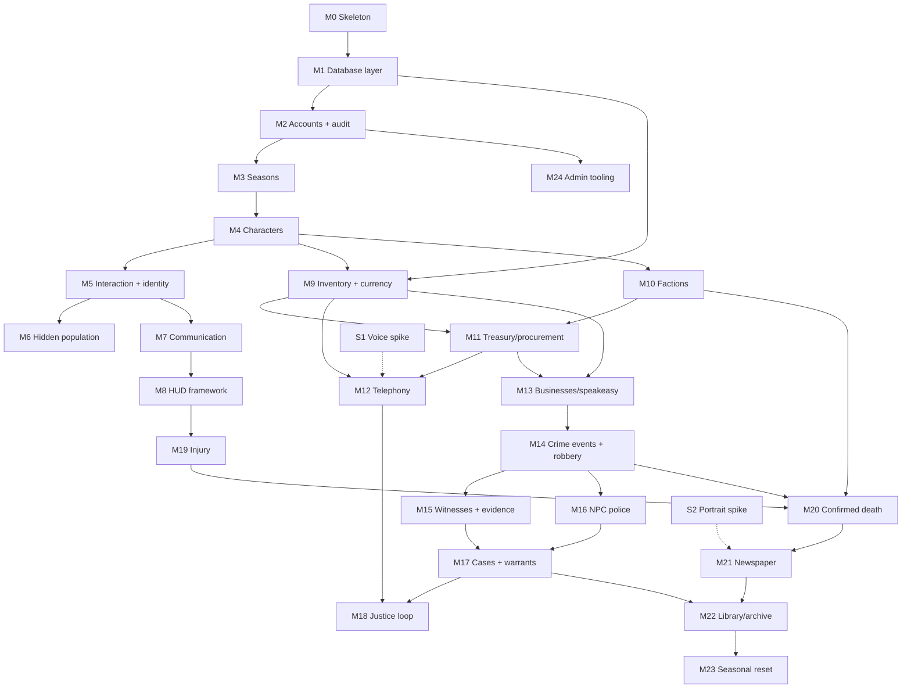

# Omertà RP — Development Roadmap (Phase 2)

Milestones are sized to be independently implementable and testable, each gated by its own design review (the project's Phase 3/4 process). Ordering follows Tech §24's five phases, expanded with the foundation the Tech doc assumes (M0–M1), the justice loop (M18, from P-002), and explicit spikes for the high-risk areas in Tech §25.

**Definition of done for every milestone:** design review approved → implementation → self-review against the design → testing per the milestone's "testable when" → written handoff (what was built, why, extension points, integration points, test strategy). Placeholder art is always acceptable (D-005).

---

## Track A — Foundation (strictly ordered; everything depends on this)

### M0 — Gamemode skeleton and core framework
Bootable from-scratch gamemode: folder structure, module loader with dependency-ordered lifecycle, schema-validated configuration (shared vs. server-secret), logging with channels and an audit sink stub, net-message registry conventions with validation/rate-limit scaffolding, headless-testable pure-Lua core.
**Depends on:** nothing. **Testable when:** the gamemode boots on an empty map with zero errors; a demo module loads/enables in dependency order; malformed config fails loudly; core libraries pass unit tests under plain Lua.
**Design review:** `docs/design-reviews/M0_foundation.md` (delivered, awaiting approval).

### M1 — Database abstraction layer
Single async public API over SQLite (bundled) and MySQL/MariaDB via mysqloo, selected by one server-secret config value with zero gameplay-code changes (project-lead hard requirement). Parameterized queries only; migration runner with versioned migrations; transaction helpers; connection health/reconnect handling; query audit hooks.
**Depends on:** M0. **Testable when:** an identical test suite (CRUD, transactions, migration up/down, injection attempts, reconnect) passes against both backends unchanged.

### M2 — Accounts and audit foundation
Account records keyed by SteamID64 (Tech §2); connect/disconnect flow; moderation flags; career-stat skeleton; the real audit log (Tech §23) writing through M1.
**Depends on:** M1. **Testable when:** joining creates/loads an account on both backends; audited actions produce queryable rows.

### M3 — Seasons
Season lifecycle (create/activate/end states, ruleset version — Tech §2); everything season-scoped keys on SeasonID from birth. Includes the Q-2/Q-4 rulings (allegiance track selection, season-end character retirement) once decided.
**Depends on:** M2. **Testable when:** a season can be created and activated; account path selection is recorded; season state survives restart.

### M4 — Characters
Creation flow (first/last name, appearance descriptors captured for later portrait use — P-001), name validation and season-unique index (Tech §3), one-active-character rule (Q-3), spawn/load, retirement/death status fields.
**Depends on:** M3. **Testable when:** two accounts cannot create duplicate normalized names in a season; a character persists across reconnect and restart; appearance snapshot is stored.

### M5 — Interaction framework, identity, and introductions
Context-interaction system (target at range → server-validated actions); the Introduce Yourself flow writing IdentityKnowledge (Tech §5); `ResolveDisplayName` (Tech §6) with server-side resolution and minimal replication.
**Depends on:** M4. **Testable when:** with three clients, A↔B introduction updates only A and B; C still sees "Unknown"; knowledge persists across sessions; no full identity map ever reaches a client (verified by inspecting network traffic).

### M6 — Hidden-population hardening
Scoreboard suppression/replacement, join/leave and death-notice removal, team-API hygiene, chat/console leak audit (Tech §4); metagaming rules spec (deliverable). Spike S3's audit harness runs from here on.
**Depends on:** M5 (needs the custom identity layer to exist). **Testable when:** the S3 harness reports zero character-identity leaks in networked state; default HUD/scoreboard surfaces are gone.

### M7 — Communication core
Distance-based voice; range-limited local text treated as speech, per-recipient name resolution, server moderation log (Tech §7 local sections).
**Depends on:** M5. **Testable when:** text/voice reach only in-range clients; speaker labels resolve per-observer; moderation copies are queryable.

### M8 — Contextual HUD framework
UI-state controller: empty screen by default; stamina and injury indicators (placeholder logic), interaction prompts, accessibility baseline (scalable text, sound-independent cues) (Tech §8). Includes the Q-7 stamina ruling.
**Depends on:** M5, M7. **Testable when:** no permanent HUD elements render; each contextual element appears only under its condition.

### M9 — Inventory, items, and physical currency
Data-driven item definitions; capacity model; containers, equipment slots, concealment categories; server-authoritative transactional operations (Tech §9); denominated coin/bill items per D-004 (quarters exist here — M12 needs them).
**Depends on:** M1, M4. **Testable when:** all operations validate distance/permission/capacity; a dropped item survives restart; currency stacks merge/split correctly; duplication attempts via rapid parallel operations fail.

## Track B — Organizations

### M10 — Factions core: families and police department
The four family institutions and the PD as persistent season entities; rosters, rank ladders (GDD §4), configurable rank permissions; recruitment/promotion flows with sponsorship and approval (GDD §4.1); acting leadership and succession rules (Tech §19); family ledger; leadership rules spec (deliverable). Includes the Q-1 bootstrap ruling.
**Depends on:** M4; M9 for ledger/equipment tagging. **Testable when:** a full recruit→associate→soldier promotion chain works with correct permission gates; the Don going offline hands acting authority down the configured chain; all transitions are audited.

### M11 — Treasury and procurement
Family/PD treasuries with transactional, audited entries (Tech §10); data-driven procurement catalog (communications, weapons, medical, disguises, …); rank-gated purchasing; organization-owned equipment tagging.
**Depends on:** M10, M9. **Testable when:** concurrent spends cannot overdraw; every balance change has an audit row with approver; purchased items carry the organization tag.

### M12 — Telephony (payphones and private lines)
Per D-003: payphone world entities with server-validated quarter feed (connect cost + interval cost, low-change warning, drop on nonpayment); private lines purchasable through procurement, bound to owned locations; call mediation (server call state, participant-only remote audio, local-side spatial speech); text-call fallback for accessibility; number knowledge as learned data/notes; call-detail records for later warrants (Tech §7).
**Depends on:** M9 (quarters), M11 (private-line purchase), M7, **S1 outcome**. **Testable when:** a call connects only while quarters last; bystanders hear the local side only; a mic-less client completes a call via text; CDRs record line-to-line metadata, never content.

## Track C — City gameplay

### M13 — Businesses and the speakeasy
Business framework (Tech §11): ownership, manager rosters, inventory, ledgers, services; the speakeasy MVP (food/drink with Q-7 buffs, social space, storage, rumor NPC, surveillance points, newspaper spawn); offline-asset-protection ruling (Q-12) as part of this review.
**Depends on:** M9, M10/M11 for ownership and money flows. **Testable when:** a speakeasy sells stock from its inventory into its ledger; the rumor NPC serves rumor entries; access control follows ownership.

### M14 — Crime events, store robbery, NPC victims
EventService (durable EventIDs — review improvement #1); robbery operation state machine (Tech §16); NPC victim reaction model (weapon/mask/aggression/personality → comply/stall/alarm/flee — GDD §12); store robbery end-to-end with proceeds as physical cash.
**Depends on:** M9, M13; weapons decision Q-10. **Testable when:** a two-player masked store robbery produces an event, an alarm path, physical proceeds, and correct state transitions through Escaped/Failed.
**Note (C4):** bank robbery is a fast-follow content milestone on this framework — after M16/M17 prove the loop — rather than Phase 5 (pending approval of review improvement #3).

### M15 — Witnesses and evidence
Witness records with descriptor generation from actual appearance, confidence, decay (Tech §12); evidence entities with type, integrity, chain of custody (Tech §13); collection interactions for police; concealment interplay (masks vs. descriptors, gloves vs. fingerprints).
**Depends on:** M14. **Testable when:** a masked robbery yields descriptor-only witness records (never a CharacterID the witness couldn't know); collected evidence carries custody chains; decay measurably reduces recall.

### M16 — NPC police response
Alarm → delay → dispatch → secure → confront → scene-creation state machine with population-scaling inputs (Tech §15); defeatable, predictable, never identity-omniscient.
**Depends on:** M14. **Testable when:** with zero player police, an alarmed robbery produces an NPC response and a preserved evidence scene; response scales with configured heat inputs.

### M17 — Cases and warrants
Case files (suspects, evidence links, per-allegation strength — Tech §14); deterministic NPC-judge warrant thresholds; scope/expiration; illegal-search detection feeding department standing.
**Depends on:** M15; M16 for scene handoff. **Testable when:** linking sufficient evidence crosses the warrant threshold deterministically; out-of-scope searches are flagged and the evidence marked; the full store-robbery→case→warrant→arrest loop closes.

### M18 — Justice loop
Post-arrest consequence system per the P-002 selection (`04_justice_system_proposals.md`): booking, charges, plea/deal resolution, fines, probation, criminal records, appeals — whatever the chosen design specifies. Scope finalizes at its design review.
**Depends on:** M17; M11 (fines/bail money flows); M12 (the booking phone call). **Testable when:** per the selected proposal's flow — at minimum, an arrest resolves into recorded consequences without a raw jail timer, and an innocent release leaves the correct record trail.

## Track D — Consequences and history

### M19 — Injury, incapacitation, and medical care
The 7-state machine (Tech §17); incapacitation interactions (carry, search, arrest, treat); stabilization items, hospital, illegal doctor; recovery timers.
**Depends on:** M8 (indicators), M5 (interactions). Can start in parallel with Track C after M8. **Testable when:** lethal-damage scenarios land in Incapacitated, not respawn; each listed interaction works on an incapacitated character; treatment paths lead to Recovering.

### M20 — Confirmed death and succession
Deliberate, logged, interruptible confirm-kill interaction (Tech §18); death cascade (status, rank removal, succession trigger, death event, body/evidence preservation, newspaper eligibility, archive references, new-character flow); no automatic transfer of anything (GDD §19.3); confirmed-death rules spec (deliverable).
**Depends on:** M19, M10 (succession), M14 (events). **Testable when:** a confirmed kill on a Capo triggers the full cascade including acting-leadership handoff; the victim's player reaches new-character creation; every step is audited.

### M21 — Newspaper
Template-driven article generation from eligible events (Tech §20); scheduled issues (Q-6 cadence), frozen on publish; physical paper props/reading UI; Option E composite portraits from archived appearance data with silhouette fallback (P-001).
**Depends on:** M14/M20 (events), M4 (appearance snapshots); **S2 outcome**. **Testable when:** an identified public death produces a correct next-issue article with portrait; hidden information (factions, unwitnessed killers) never appears; issues are immutable after publication.

### M22 — Library and archive
Archive indexes (Tech §21); library browsing/search UI over seasons, characters, headlines, cases; public/private record rules.
**Depends on:** M21, M17. **Testable when:** every published issue and closed case is findable in the library; secret records are absent until release conditions are met.

### M23 — Seasonal reset end-to-end
Archive-then-reset as a single resumable, audited job: season summaries, award computation, wipe of seasonal state, preservation of account/archive data (Tech §22); rehearsal procedure documented.
**Depends on:** M22 and effectively everything. **Testable when:** a staged full season resets cleanly; interrupting the job mid-run and resuming loses nothing; the archive fully reflects the ended season on both DB backends.

### M24 — Administration and audit tooling
Staff-only UI over the audit log (Tech §23): introductions, transactions, deaths, warrants, faction transitions; leak-proof (no ordinary-gameplay exposure); moderation workflows for the rules specs.
**Depends on:** M2 onward (log exists); build UI once systems stabilize. **Testable when:** staff can answer "who knew X, who paid Y, who killed Z" from the UI alone; non-staff clients never receive audit data.

---

## Technical spikes (timeboxed, run during Track A)

| Spike | Question | Feeds | Timing |
|---|---|---|---|
| S1 — Voice routing | Can call audio be routed participant-only while local speech stays spatial? Is any speakerphone approximation viable? | M12 scope | Before M12's design review |
| S2 — Portrait rendering | Prototype Option E: deterministic client-side composite portrait from an appearance snapshot, newspaper-styled | M21, M4 (snapshot format) | Before M4 freezes the appearance schema |
| S3 — Identity-leak audit harness | Automated scan of networked state/messages for character-identity leaks; catalog of engine-level leaks we must accept and cover by rules | M6 and continuously | Alongside M5/M6 |

## Parallel content workstream (not code milestones)

- **Map**: the single largest external dependency (Q-9). Prototype all systems on an existing urban map with placeholder props (D-005); commission/build the final compact neighborhood in parallel; required locations: 2–4 family properties, PD, speakeasy + required businesses (GDD §11), stores, bank, library, hospital, payphone placements.
- **Weapons**: small period arsenal (BA §27) per Q-10 decision.
- **Playermodels/clothing**: timeless-era dress (D-002); disguise items must map to the witness descriptor system (Tech §12) — placeholder models acceptable until then.

## Dependency graph

## Foundational systems

M0–M9 are foundational: every later milestone consumes the module loader, the DB layer, audit, seasons/characters, identity resolution, and inventory. They must be built carefully and reviewed strictly — rework here multiplies. Tracks C and D contain the parallelization opportunities (M19 can proceed alongside Track C; M24 is incremental throughout).

## MVP line

The GDD §22 MVP is satisfied at **M23 complete** plus the bank-robbery fast-follow (C4) and the content workstream's map. Tech §24 Phase 5 items (informants beyond the justice loop's needs, corrupt-police tooling, sit-down mechanics, territory/influence, advanced records, funerals, bank *operations*) remain post-MVP.
